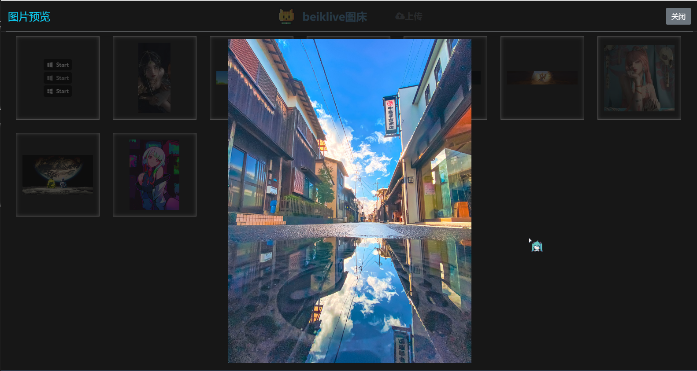
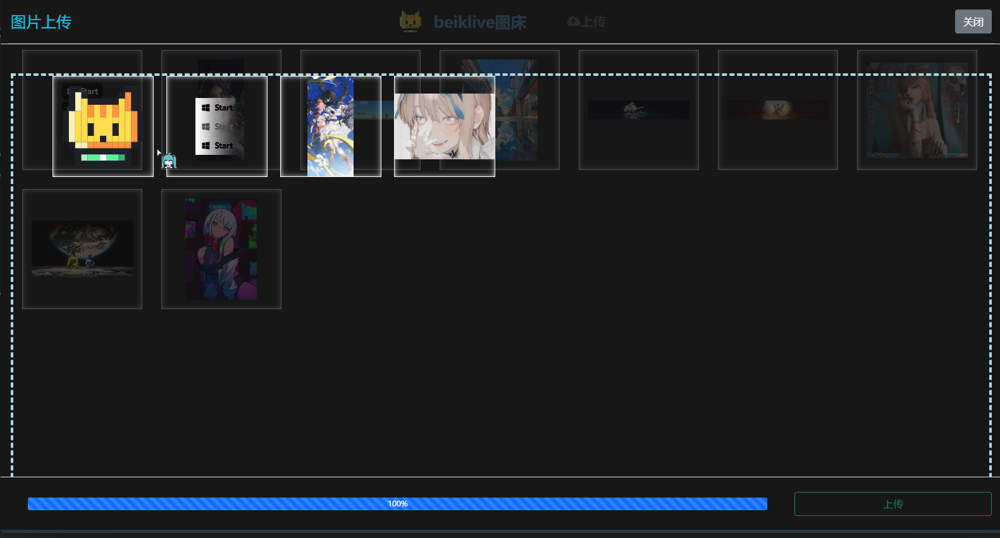

# WebApp-PicBed
# 在线相册服务
# 介绍
一个简易的相册系统，更多功能后续再开发

图床程序采用python编写，使用tornado框架驱动web服务器

主旨： 开箱即用，不需要过多的环境和配置


# 使用

## 配置修改

1. 修改`WebApp-PicBed\PicBedApi\templates\config.json`

    ```json
    {
        "url" : "http://example.com:8080",
        "title" : "图床",
        "port": 8080,
        "passwd" : "12345678"
    }
    ```

    `url`为网页向服务器发送请求的地址，一般就是服务器ip/域名+端口号

    `title`为网页的标题 

    `port`为程序的启动端口，`url`的端口需要与该`port`一致

    `passwd`为前端页面的登录密码，需要登录状态才能进行上传操作

2. 修改log图标

   替换`WebApp-PicBed\PicBedApi\templates\Resource\logo.png`文件即可

## 启动

```shell
./startup.sh start
```
## 关闭
```shell
./startup.sh close
```
## 查看运行状态
```shell
./startup.sh show
```
# 预览
### 主界面


### 图片预览



### 图片上传




# 已有功能
1. 上传图片
2. 随机获取相册已存的图片
    > http://img.example.com/redirect?type=random

