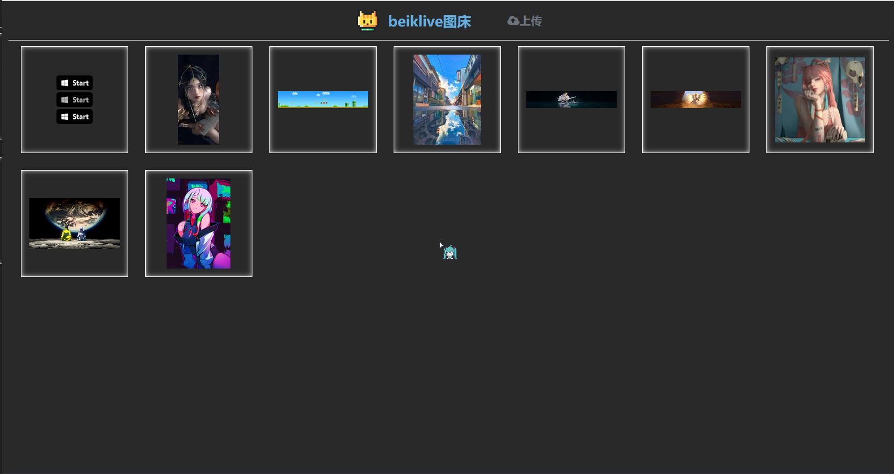

# WebApp-PicBed
# 在线相册


# 介绍
一个简易的相册系统，更多功能后续再开发

图床程序采用python编写，使用tornado框架驱动web服务器

# 使用

## 环境安装

`python >= 3.6`

```bash
source requirements.txt
```


## 初始配置修改（必须修改！！！）

1. 修改`config.yml`

    | Key        | Type     | Value                                                        |
    | ---------- | -------- | ------------------------------------------------------------ |
    | WebSite    | `string` | 启动后服务的地址，如：`http://picture.xxx.com `  或者   `127.0.0.1:8080` |
    | SiteTitle  | `string` | 网站标题栏名称                                               |
    | port       | `number` | 服务的端口号                                                 |
    | UserName   | `string` | 用户名                                                       |
    | Passwd     | `string` | 默认进入服务是未登录状态，使用该密码登录                     |
    | Active     | `string` | `true`  原图与略缩图都从腾讯云cos获取<br>`auto` 略缩图从服务本地获取，原图从腾讯云cos获取，减少腾讯云cos的请求次数<br>`false` 全部使用服务本地图片 |
    | Bucket     | `string` | 腾讯对象存储桶名称                                           |
    | region     | `string` | 存储桶所属地区如： `ap-beijing`                              |
    | secret_id  | `string` | 使用对象存储时填写，从腾讯云控制台获取                       |
    | secret_key | `string` | 使用对象存储时填写，从腾讯云控制台获取                       |

2. 修改log图标

​		替换`WebApp-PicBed\PicBedApi\templates\Resource\logo.png`文件即可

## 启动

```shell
./startup.sh start
```
## 关闭
```shell
./startup.sh close
```
## 查看运行状态
```shell
./startup.sh show
```


# 预览
### 主界面



### 图片预览


### 图片上传


# 功能
- [x] 图片上传
- [x] 随机图片： url + `/redirect?type=random`
​			http://img.example.com/redirect?type=random
- [x] 登录
- [x] 删除图片
- [ ] GitPage托管


## API


### 用户注册 API

| URL         | 请求方法 | 请求体                                      | 请求头   | 功能                 | 示例响应                                                                                     |
|-------------|----------|---------------------------------------------|----------|----------------------|----------------------------------------------------------------------------------------------|
| `/register` | POST     | {"username": "new_user", "password": "123456", "email": "new_user@example.com"} | -        | 注册新用户，创建用户账号。 | {"message": "User registered successfully", "user": {"id": 1, "username": "new_user", "email": "new_user@example.com"}} |


### 用户信息管理 API

| URL         | 请求方法 | 请求体                                   | 请求头                      | 功能                         | 示例响应                                                                                    |
|-------------|----------|------------------------------------------|-----------------------------|------------------------------|---------------------------------------------------------------------------------------------|
| `/users/me` | GET      | -                                        | Authorization: Bearer {JWT Token} | 获取当前登录用户的信息。       | {"id": 1, "username": "user1", "email": "user1@example.com"}                                  |
| `/users/me` | PUT      | {"email": "updated@example.com"}         | Authorization: Bearer {JWT Token} | 更新当前登录用户的信息。       | {"id": 1, "username": "user1", "email": "updated@example.com"}                                 |


### 图片管理 API

| URL                               | 请求方法 | 请求体                                             | 请求头                      | 功能                       | 示例响应                                                                                                     |
|-----------------------------------|----------|----------------------------------------------------|-----------------------------|----------------------------|--------------------------------------------------------------------------------------------------------------|
| `/albums/{album_id}/photos`       | POST     | FormData 格式，包含图片文件和相关信息                 | Authorization: Bearer {JWT Token} | 向指定相册上传图片。            | {"id": 1, "filename": "photo1.jpg", "description": "这是上传的图片1"}                                             |
| `/albums/{album_id}/photos`       | GET      | -                                                  | Authorization: Bearer {JWT Token} | 获取指定相册的所有图片列表。     | [{"id": 1, "filename": "photo1.jpg", "description": "这是上传的图片1"}, {"id": 2, "filename": "photo2.jpg", "description": "这是上传的图片2"}] |
| `/albums/{album_id}/photos/{photo_id}` | GET      | -                                                  | Authorization: Bearer {JWT Token} | 根据图片ID获取单张图片的信息。    | {"id": 1, "filename": "photo1.jpg", "description": "这是上传的图片1"}                                             |
| `/albums/{album_id}/photos/{photo_id}` | PUT      | {"description": "更新后的图片描述"}                    | Authorization: Bearer {JWT Token} | 根据图片ID更新图片的信息。        | {"id": 1, "filename": "photo1.jpg", "description": "更新后的图片描述"}                                           |
| `/albums/{album_id}/photos/{photo_id}` | DELETE   | -                                                  | Authorization: Bearer {JWT Token} | 根据图片ID删除图片。             | HTTP状态码 204 No Content                                                                                    |


### 相册相关 API

| URL             | 请求方法 | 请求体                                       | 请求头                  | 功能                                             | 示例响应                                                                                            |
|-----------------|----------|----------------------------------------------|-------------------------|--------------------------------------------------|-----------------------------------------------------------------------------------------------------|
| `/albums`       | GET      | -                                            | Authorization: Bearer {JWT Token} | 获取当前用户的所有相册列表。                         | [{"id": 1, "title": "相册1", "description": "这是相册1的描述"}, {"id": 2, "title": "相册2", "description": "这是相册2的描述"}] |
| `/albums`       | POST     | {"title": "新相册", "description": "这是新相册的描述"} | Authorization: Bearer {JWT Token} | 创建当前用户的新相册。                              | {"id": 3, "title": "新相册", "description": "这是新相册的描述"}                                      |
| `/albums/{id}`  | GET      | -                                            | Authorization: Bearer {JWT Token} | 根据相册ID获取单个相册的信息。                     | {"id": 1, "title": "相册1", "description": "这是相册1的描述"}                                      |
| `/albums/{id}`  | PUT      | {"title": "更新后的相册", "description": "更新后的描述"} | Authorization: Bearer {JWT Token} | 根据相册ID更新相册的信息。                          | {"id": 1, "title": "更新后的相册", "description": "更新后的描述"}                                    |
| `/albums/{id}`  | DELETE   | -                                            | Authorization: Bearer {JWT Token} | 根据相册ID删除相册。                               | HTTP状态码 204 No Content                                                                           |
